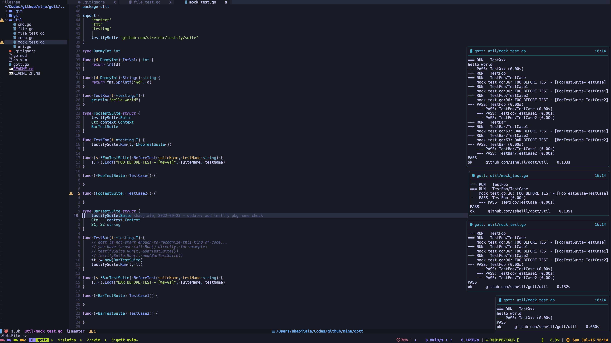

# gott.nvim

Exec go test under cursor easily.


## Screenshot




## Requirements

- [gott](https://github.com/sshelll/gott) (required)

> Install: `go install github.com/sshelll/gott/v2@latest`  
> **Note: the version of `gott` should be greater than v2.0.0, **
>
> **which means you <u>should not</u> use `go install github.com/sshelll/gott@latest`**

- [nvim-notify](https://github.com/rcarriga/nvim-notify) (required)

> Install: check https://github.com/rcarriga/nvim-notify for more details.

- [vim-dispatch](https://github.com/tpope/vim-dispatch) (optional)

> This plug allows you run test async, check https://github.com/tpope/vim-dispatch for more details.


## Install

Use your nvim plug manager.

Such as: `Plug 'sshelll/gott.nvim'`


## Commands

1. `Gott`

​	Run go test under cursor. For example:

```sh
:Gott
:Gott -v
:Gott -v -race
:Gott -vet=off -race
```

2. `GottFile`

​	Run all go tests of the current buffer. For example:

```sh
:GottFile
:GottFile -v
:GottFile -v -race
:GottFile -vet=off -race
```

3. `GottClear`

​	Clear all the notifications.

4. `GottAsync`

   Run go test under cursor async. You have to install [vim-dispatch](https://github.com/tpope/vim-dispatch) first.
   
6. `GottFileAsync`

   Run all go tests of the current buffer async. You have to install [vim-dispatch](https://github.com/tpope/vim-dispatch) first.

## Configuration

```lua
require('gott').setup{
    timeout = 3000,    -- try to close go test result notification after 3s.
    keep = function () -- decide whether to keep the notification after timeout(3s).
        return false
    end,
    render = 'default', -- default / minimal / simple / compact, controls the notification style.
    test_args = '-v -race', -- these args will be passed to go test command at any time.
}
```

The default conf is:

```lua
require('gott').setup{
    keep = function () -- keep the notification after timeout, which means the notification window will not be closed.
        return true    -- if you want to close them, just call ':GottClear'.
    end,
    render = 'default',
    test_args = '-v -vet=off',
}
```

